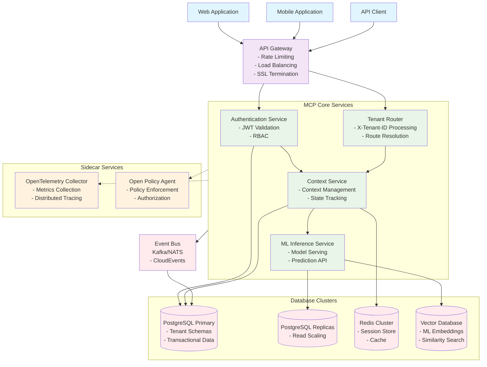
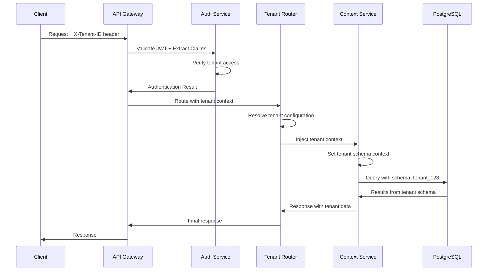

# System Architecture Documentation

## 1. Overview Architecture

### High-Level System Diagram



## 2. Component Specifications

### 2.1 Authentication Service
- **Language/Runtime**: Go 1.21+
- **Container Image**: `distroless/static:nonroot`
- **Resource Targets**:
  - CPU: 200m (request), 500m (limit)
  - Memory: 256Mi (request), 512Mi (limit)
- **Scaling Triggers**:
  - HPA: CPU > 70%, Memory > 80%
  - Min replicas: 2, Max replicas: 10
- **Ports**: 8080 (HTTP), 8443 (HTTPS), 9090 (metrics)

### 2.2 Tenant Router Service
- **Language/Runtime**: Go 1.21+
- **Container Image**: `distroless/static:nonroot`
- **Resource Targets**:
  - CPU: 100m (request), 300m (limit)
  - Memory: 128Mi (request), 256Mi (limit)
- **Scaling Triggers**:
  - HPA: CPU > 75%, Custom metric: requests/sec > 1000
  - Min replicas: 3, Max replicas: 15
- **Ports**: 8080 (HTTP), 9090 (metrics)

### 2.3 Context Service
- **Language/Runtime**: Java 17 (Spring Boot 3.x)
- **Container Image**: `eclipse-temurin:17-jre-alpine`
- **Resource Targets**:
  - CPU: 500m (request), 1000m (limit)
  - Memory: 512Mi (request), 1Gi (limit)
- **Scaling Triggers**:
  - HPA: CPU > 60%, Memory > 70%
  - Min replicas: 2, Max replicas: 8
- **Ports**: 8080 (HTTP), 9090 (metrics), 8081 (actuator)

### 2.4 ML Inference Service
- **Language/Runtime**: Python 3.11 (FastAPI + PyTorch)
- **Container Image**: `python:3.11-slim`
- **Resource Targets**:
  - CPU: 1000m (request), 2000m (limit)
  - Memory: 2Gi (request), 4Gi (limit)
  - GPU: 1 (optional, for heavy models)
- **Scaling Triggers**:
  - HPA: CPU > 50%, Custom metric: inference_queue_depth > 100
  - Min replicas: 1, Max replicas: 5
- **Ports**: 8000 (HTTP), 8001 (metrics)

### 2.5 API Gateway
- **Technology**: Istio Gateway + Envoy Proxy
- **Resource Targets**:
  - CPU: 500m (request), 1000m (limit)
  - Memory: 512Mi (request), 1Gi (limit)
- **Scaling Triggers**:
  - HPA: CPU > 80%, connections > 10000
  - Min replicas: 2, Max replicas: 10

### 2.6 Sidecar Services

#### OpenTelemetry Collector
- **Container Image**: `otel/opentelemetry-collector:latest`
- **Resource Targets**:
  - CPU: 100m (request), 200m (limit)
  - Memory: 128Mi (request), 256Mi (limit)
- **Ports**: 4317 (gRPC), 4318 (HTTP), 8889 (metrics)

#### Open Policy Agent (OPA)
- **Container Image**: `openpolicyagent/opa:latest-envoy`
- **Resource Targets**:
  - CPU: 50m (request), 100m (limit)
  - Memory: 64Mi (request), 128Mi (limit)
- **Ports**: 8181 (HTTP API), 9191 (metrics)

## 3. Data Contracts and Event Schemas

### 3.1 CloudEvents Schema

```json
{
  "specversion": "1.0",
  "type": "com.mcp.tenant.context.updated",
  "source": "context-service",
  "id": "unique-event-id",
  "time": "2024-01-01T12:00:00Z",
  "datacontenttype": "application/json",
  "subject": "tenant-123/context-456",
  "data": {
    "tenantId": "tenant-123",
    "contextId": "context-456",
    "userId": "user-789",
    "operation": "update",
    "changes": {
      "field": "value"
    },
    "timestamp": "2024-01-01T12:00:00Z"
  }
}
```

### 3.2 API Data Contracts

#### Authentication Token Response
```json
{
  "access_token": "jwt-token-string",
  "token_type": "Bearer",
  "expires_in": 3600,
  "refresh_token": "refresh-token-string",
  "tenant_id": "tenant-123",
  "user_id": "user-789",
  "permissions": ["read", "write", "admin"]
}
```

#### Context API Request/Response
```json
{
  "context_id": "ctx-uuid",
  "tenant_id": "tenant-123",
  "user_id": "user-789",
  "session_id": "session-uuid",
  "metadata": {
    "created_at": "2024-01-01T12:00:00Z",
    "updated_at": "2024-01-01T12:00:00Z",
    "version": 1
  },
  "data": {
    "conversation_history": [],
    "user_preferences": {},
    "context_variables": {}
  }
}
```

## 4. Deployment Topology

### 4.1 Kubernetes Namespace Structure

```yaml
# Development Environment
apiVersion: v1
kind: Namespace
metadata:
  name: mcp-dev
  labels:
    environment: development
    team: platform
---
# Staging Environment
apiVersion: v1
kind: Namespace
metadata:
  name: mcp-stage
  labels:
    environment: staging
    team: platform
---
# Production Environment
apiVersion: v1
kind: Namespace
metadata:
  name: mcp-prod
  labels:
    environment: production
    team: platform
```

### 4.2 GitOps with ArgoCD

```yaml
apiVersion: argoproj.io/v1alpha1
kind: Application
metadata:
  name: mcp-platform
  namespace: argocd
spec:
  project: default
  source:
    repoURL: https://github.com/company/mcp-platform
    targetRevision: HEAD
    path: k8s/overlays/production
  destination:
    server: https://kubernetes.default.svc
    namespace: mcp-prod
  syncPolicy:
    automated:
      prune: true
      selfHeal: true
    syncOptions:
    - CreateNamespace=true
```

### 4.3 Crossplane Infrastructure

```yaml
apiVersion: pkg.crossplane.io/v1
kind: Configuration
metadata:
  name: mcp-infrastructure
spec:
  package: registry.company.com/mcp/infrastructure:v1.0.0
  packagePullPolicy: IfNotPresent
---
apiVersion: infrastructure.mcp.com/v1alpha1
kind: DatabaseCluster
metadata:
  name: mcp-postgres
spec:
  provider: aws # or gcp, azure
  region: us-west-2
  instanceClass: db.r5.xlarge
  multiAZ: true
  backupRetentionPeriod: 7
  environmentRef:
    name: production
```

## 5. Tenant Routing Pattern

### 5.1 Request Flow Diagram



### 5.2 Tenant Context Middleware

```go
// Tenant Context Middleware (Go)
func TenantContextMiddleware(next http.Handler) http.Handler {
    return http.HandlerFunc(func(w http.ResponseWriter, r *http.Request) {
        tenantID := r.Header.Get("X-Tenant-ID")
        if tenantID == "" {
            http.Error(w, "Missing X-Tenant-ID header", http.StatusBadRequest)
            return
        }
        
        // Validate tenant exists and user has access
        if !validateTenantAccess(r.Context(), tenantID, getUserID(r)) {
            http.Error(w, "Unauthorized tenant access", http.StatusForbidden)
            return
        }
        
        // Inject tenant context
        ctx := context.WithValue(r.Context(), "tenant_id", tenantID)
        next.ServeHTTP(w, r.WithContext(ctx))
    })
}
```

### 5.3 PostgreSQL Schema Switching

```sql
-- Database schema per tenant
CREATE SCHEMA IF NOT EXISTS tenant_123;
CREATE SCHEMA IF NOT EXISTS tenant_456;

-- Set search path based on tenant context
SET search_path TO tenant_123, public;

-- All queries now operate within tenant schema
SELECT * FROM contexts WHERE user_id = $1;
```

### 5.4 Tenant Configuration

```yaml
apiVersion: v1
kind: ConfigMap
metadata:
  name: tenant-routing-config
  namespace: mcp-prod
data:
  routing.yaml: |
    tenants:
      tenant-123:
        name: "Acme Corp"
        schema: "tenant_123"
        features:
          - "ml_inference"
          - "advanced_analytics"
        limits:
          requests_per_minute: 1000
          concurrent_contexts: 100
      tenant-456:
        name: "Beta Inc"
        schema: "tenant_456"
        features:
          - "basic_features"
        limits:
          requests_per_minute: 500
          concurrent_contexts: 50
```

## 6. Observability and Monitoring

### 6.1 OpenTelemetry Configuration

```yaml
receivers:
  otlp:
    protocols:
      grpc:
        endpoint: 0.0.0.0:4317
      http:
        endpoint: 0.0.0.0:4318

processors:
  batch:
    timeout: 1s
    send_batch_size: 1024
  resource:
    attributes:
      - key: service.namespace
        value: mcp-prod
        action: upsert

exporters:
  prometheus:
    endpoint: "0.0.0.0:8889"
  jaeger:
    endpoint: jaeger-collector:14250
    tls:
      insecure: true

service:
  pipelines:
    traces:
      receivers: [otlp]
      processors: [batch, resource]
      exporters: [jaeger]
    metrics:
      receivers: [otlp]
      processors: [batch, resource]
      exporters: [prometheus]
```

## 7. Security and Policy Enforcement

### 7.1 OPA Policy Example

```rego
package mcp.authz

import future.keywords.in

default allow = false

# Allow access if user has valid tenant access
allow {
    input.method == "GET"
    input.tenant_id in data.user_tenants[input.user_id]
    input.resource_type == "context"
}

# Admin users can access all tenants
allow {
    input.user_role == "admin"
}

# Deny if tenant is suspended
deny {
    data.suspended_tenants[input.tenant_id]
}
```

## 8. C4 Architecture Diagrams

The system architecture will be documented using C4 diagrams rendered via `py-plantuml` in the CI/CD pipeline. The diagrams will include:

1. **System Context Diagram**: Shows MCP platform and external systems
2. **Container Diagram**: Details the containers and their relationships
3. **Component Diagram**: Breaks down key containers into components
4. **Code Diagram**: Shows key classes and their relationships

### CI Pipeline Configuration

```yaml
# .github/workflows/docs.yml
name: Generate Architecture Diagrams
on:
  push:
    paths:
      - 'docs/architecture/**'
      - '.github/workflows/docs.yml'

jobs:
  generate-diagrams:
    runs-on: ubuntu-latest
    steps:
      - uses: actions/checkout@v3
      - name: Setup Python
        uses: actions/setup-python@v4
        with:
          python-version: '3.11'
      - name: Install dependencies
        run: |
          pip install py-plantuml
          pip install plantuml
      - name: Generate C4 diagrams
        run: |
          python scripts/generate_c4_diagrams.py
      - name: Commit generated diagrams
        run: |
          git config --local user.email "action@github.com"
          git config --local user.name "GitHub Action"
          git add docs/diagrams/
          git commit -m "Update architecture diagrams" || exit 0
          git push
```

This architecture provides a scalable, multi-tenant platform with proper separation of concerns, observability, and security controls. The system is designed to handle enterprise-scale workloads with proper tenant isolation and monitoring capabilities.
