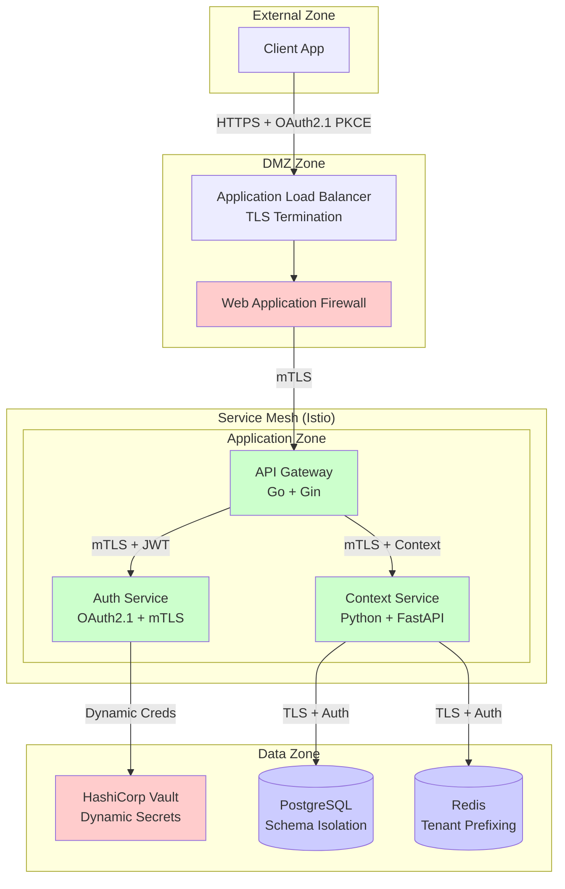

# Technology Stack Finalization & PoC Planning

## Executive Summary

Based on our research documentation, this document finalizes the technology stack for the MCP (Model Context Protocol) platform and outlines a security-first PoC implementation focusing on least privilege principles and secure authorization methods.

## Final Technology Stack Decisions

### Core Application Stack

| Component | Selected Technology | Rationale | Security Considerations |
|-----------|-------------------|-----------|------------------------|
| **API Framework** | Go with Gin | Faster development cycle, strong security ecosystem, single binary deployment | Built-in TLS support, minimal attack surface |
| **ML Service** | Python with FastAPI | ML ecosystem compatibility, async support, auto-documentation | Type validation, async security middleware |
| **Database** | PostgreSQL 15+ with pgvector | ACID compliance, vector support, schema isolation | Row-level security, SSL required |
| **Cache/Queue** | Redis 7+ | Performance, persistence options, clustering | AUTH enabled, TLS encryption |
| **Service Mesh** | Istio | mTLS automation, security policies, observability | Certificate rotation, zero-trust networking |

### Security Stack

| Component | Technology | Configuration | Security Features |
|-----------|------------|---------------|------------------|
| **PKI/Certificates** | cert-manager + Vault | Automated cert lifecycle | Short-lived certs (24h TTL) |
| **Secrets Management** | HashiCorp Vault | Dynamic secrets, audit logging | Encryption in transit/rest, audit trail |
| **Authentication** | OAuth2.1 PKCE + mTLS | Multi-factor approach | Certificate-based service auth |
| **Authorization** | OPA Gatekeeper | Policy as code | Fine-grained RBAC |
| **Container Security** | Distroless + Trivy | Minimal base images, vuln scanning | Non-root execution, readonly filesystems |

### Infrastructure Stack

| Component | Technology | Configuration | Security Features |
|-----------|------------|---------------|------------------|
| **Container Runtime** | containerd | CRI-compliant, security-focused | Secure defaults, namespace isolation |
| **Orchestration** | Kubernetes 1.28+ | RBAC enabled, Pod Security Standards | Network policies, security contexts |
| **Service Discovery** | Kubernetes DNS + Istio | Native k8s integration | mTLS for all communications |
| **Monitoring** | Prometheus + Grafana + Loki | Cloud-native observability | RBAC, audit logging |
| **CI/CD** | GitHub Actions + ArgoCD | GitOps workflow | Signed commits, attestations |

## PoC Implementation Plan

### Phase 1: Simple Workflows Selection

**Selected Workflows for PoC:**

1. **User Authentication & Authorization Workflow**
   - OAuth2.1 PKCE flow implementation
   - mTLS certificate-based service authentication
   - RBAC policy enforcement

2. **Context Query & Response Workflow**
   - Simple context retrieval API
   - ML model inference pipeline
   - Multi-tenant data isolation

### Security-First Architecture



### PoC Security Requirements

#### Certificate Management
```yaml
# cert-manager Certificate for services
apiVersion: cert-manager.io/v1
kind: Certificate
metadata:
  name: mcp-service-cert
  namespace: mcp-poc
spec:
  secretName: mcp-service-tls
  issuerRef:
    name: vault-issuer
    kind: ClusterIssuer
  dnsNames:
  - api.mcp.internal
  - auth.mcp.internal
  - context.mcp.internal
  duration: 24h0m0s  # 24 hour certificate lifetime
  renewBefore: 8h0m0s  # Renew 8 hours before expiry
```

#### Least Privilege RBAC
```yaml
# Minimal service account permissions
apiVersion: v1
kind: ServiceAccount
metadata:
  name: api-service
  namespace: mcp-poc
---
apiVersion: rbac.authorization.k8s.io/v1
kind: Role
metadata:
  name: api-service-role
  namespace: mcp-poc
rules:
- apiGroups: [""]
  resources: ["secrets"]
  resourceNames: ["mcp-service-tls"]
  verbs: ["get"]
- apiGroups: [""]
  resources: ["configmaps"]
  resourceNames: ["api-config"]
  verbs: ["get"]
```

### PoC Implementation Steps

#### Week 1-2: Infrastructure Foundation
1. **Kubernetes Cluster Setup**
   ```bash
   # Using kind for local development
   kind create cluster --config=poc-cluster-config.yaml
   ```

2. **Security Infrastructure**
   ```bash
   # Install cert-manager
   kubectl apply -f https://github.com/cert-manager/cert-manager/releases/download/v1.13.0/cert-manager.yaml
   
   # Install Vault
   helm install vault hashicorp/vault --namespace vault-system --create-namespace
   
   # Install Istio
   istioctl install --set values.defaultPodDisruptionBudget.enabled=false
   ```

3. **Security Policies**
   ```bash
   # Install OPA Gatekeeper
   kubectl apply -f https://raw.githubusercontent.com/open-policy-agent/gatekeeper/release-3.14/deploy/gatekeeper.yaml
   ```

#### Week 3-4: Core Services Development

1. **API Gateway Service (Go)**
   ```go
   // main.go - Secure API Gateway
   package main
   
   import (
       "crypto/tls"
       "crypto/x509"
       "log"
       "net/http"
       
       "github.com/gin-gonic/gin"
   )
   
   func main() {
       // Load mTLS certificates
       cert, err := tls.LoadX509KeyPair("server.crt", "server.key")
       if err != nil {
           log.Fatal("Failed to load certificates:", err)
       }
       
       // Load CA for client certificate verification
       caCert, err := os.ReadFile("ca.crt")
       if err != nil {
           log.Fatal("Failed to load CA certificate:", err)
       }
       
       caCertPool := x509.NewCertPool()
       caCertPool.AppendCertsFromPEM(caCert)
       
       // Configure TLS with client certificate verification
       tlsConfig := &tls.Config{
           Certificates: []tls.Certificate{cert},
           ClientAuth:   tls.RequireAndVerifyClientCert,
           ClientCAs:    caCertPool,
           MinVersion:   tls.VersionTLS13,
       }
       
       router := gin.Default()
       
       // Security middleware
       router.Use(SecurityHeadersMiddleware())
       router.Use(AuthenticationMiddleware())
       router.Use(AuthorizationMiddleware())
       
       // Health check endpoint
       router.GET("/health", func(c *gin.Context) {
           c.JSON(200, gin.H{"status": "healthy"})
       })
       
       // Protected API endpoints
       v1 := router.Group("/v1")
       v1.Use(TenantIsolationMiddleware())
       {
           v1.POST("/auth/token", authHandler)
           v1.GET("/tenants/:tenantId/contexts", contextListHandler)
           v1.POST("/tenants/:tenantId/contexts", contextCreateHandler)
       }
       
       server := &http.Server{
           Addr:      ":8443",
           Handler:   router,
           TLSConfig: tlsConfig,
       }
       
       log.Println("Starting secure server on :8443")
       log.Fatal(server.ListenAndServeTLS("", ""))
   }
   ```

2. **Context Service (Python)**
   ```python
   # main.py - Secure Context Service
   import ssl
   from fastapi import FastAPI, Depends, HTTPException, Security
   from fastapi.security import HTTPBearer, HTTPAuthorizationCredentials
   from fastapi.middleware.httpsredirect import HTTPSRedirectMiddleware
   import uvicorn
   
   app = FastAPI(
       title="MCP Context Service",
       description="Secure context management for multi-tenant MCP platform",
       version="1.0.0"
   )
   
   # Security middleware
   app.add_middleware(HTTPSRedirectMiddleware)
   
   security = HTTPBearer()
   
   async def verify_token(credentials: HTTPAuthorizationCredentials = Security(security)):
       """Verify JWT token and extract tenant context"""
       # Implement JWT verification with public key
       # Extract tenant_id from token claims
       return {"tenant_id": "extracted_tenant_id", "user_id": "user_id"}
   
   @app.middleware("http")
   async def security_headers(request, call_next):
       response = await call_next(request)
       response.headers["X-Content-Type-Options"] = "nosniff"
       response.headers["X-Frame-Options"] = "DENY"
       response.headers["X-XSS-Protection"] = "1; mode=block"
       response.headers["Strict-Transport-Security"] = "max-age=31536000; includeSubDomains"
       return response
   
   @app.get("/health")
   async def health_check():
       return {"status": "healthy"}
   
   @app.get("/v1/tenants/{tenant_id}/contexts")
   async def list_contexts(
       tenant_id: str,
       auth_data: dict = Depends(verify_token)
   ):
       # Verify tenant_id matches token
       if auth_data["tenant_id"] != tenant_id:
           raise HTTPException(status_code=403, detail="Unauthorized")
       
       # Return tenant-specific contexts
       return {"contexts": [], "tenant_id": tenant_id}
   
   if __name__ == "__main__":
       # SSL context for mTLS
       ssl_context = ssl.SSLContext(ssl.PROTOCOL_TLS_SERVER)
       ssl_context.load_cert_chain("server.crt", "server.key")
       ssl_context.load_verify_locations("ca.crt")
       ssl_context.verify_mode = ssl.CERT_REQUIRED
       
       uvicorn.run(
           app,
           host="0.0.0.0",
           port=8000,
           ssl_keyfile="server.key",
           ssl_certfile="server.crt",
           ssl_ca_certs="ca.crt",
           ssl_cert_reqs=ssl.CERT_REQUIRED
       )
   ```

#### Week 5-6: Integration & Testing

1. **mTLS Configuration**
   ```yaml
   # Istio PeerAuthentication for strict mTLS
   apiVersion: security.istio.io/v1beta1
   kind: PeerAuthentication
   metadata:
     name: default
     namespace: mcp-poc
   spec:
     mtls:
       mode: STRICT
   
   ---
   # AuthorizationPolicy for service-to-service communication
   apiVersion: security.istio.io/v1beta1
   kind: AuthorizationPolicy
   metadata:
     name: service-access
     namespace: mcp-poc
   spec:
     rules:
     - from:
       - source:
           principals: ["cluster.local/ns/mcp-poc/sa/api-service"]
       to:
       - operation:
           methods: ["GET", "POST"]
       when:
       - key: source.certificate_fingerprint
         values: ["<expected-fingerprint>"]
   ```

2. **Security Testing**
   ```bash
   # Vulnerability scanning
   trivy image mcp/api-gateway:poc
   trivy image mcp/context-service:poc
   
   # Network policy testing
   kubectl apply -f network-policies.yaml
   
   # Penetration testing with nmap
   nmap -sS -O target-ip
   ```

### PoC Success Criteria

1. **Security Criteria**
   - [ ] All communications use mTLS with certificate verification
   - [ ] Zero hardcoded secrets (all from Vault)
   - [ ] Non-root container execution
   - [ ] Network policies block unauthorized traffic
   - [ ] RBAC prevents privilege escalation

2. **Functional Criteria**
   - [ ] OAuth2.1 PKCE authentication flow working
   - [ ] Tenant isolation verified (no cross-tenant data access)
   - [ ] Context API responds within 200ms P95
   - [ ] ML inference pipeline functional

3. **Operational Criteria**
   - [ ] Certificate auto-rotation working
   - [ ] Observability dashboards showing metrics
   - [ ] Automated deployment pipeline functional
   - [ ] Security scanning integrated in CI/CD

### Risk Mitigation

| Risk | Probability | Impact | Mitigation |
|------|-------------|--------|------------|
| Certificate expiry | Medium | High | Automated renewal + monitoring alerts |
| Privilege escalation | Low | Critical | Strict RBAC + regular audits |
| Service mesh complexity | High | Medium | Comprehensive documentation + training |
| Performance impact | Medium | Medium | Load testing + optimization |

### Next Steps

1. **Immediate Actions**
   - Set up development environment with security tools
   - Create secure container images with Distroless base
   - Implement certificate management automation

2. **Week 1 Deliverables**
   - Kubernetes cluster with security baseline
   - Vault installation with PKI backend
   - Basic mTLS communication between services

3. **Week 2 Deliverables**
   - OAuth2.1 PKCE implementation
   - Tenant isolation proof of concept
   - Security policy enforcement

This PoC will demonstrate the core security principles while validating the technology stack choices for the full implementation.
