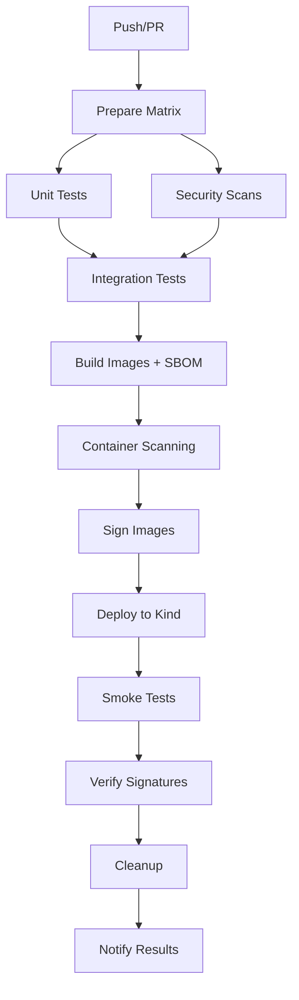

# CI/CD Pipeline Enhancements

⬅️ **[Back to Main Documentation](./README.md)**

This document provides a quick overview of the enhanced CI/CD pipeline implementation for the MCP platform.

> 📖 **See Also:** [Main README](./README.md) • [Detailed CI/CD Documentation](./docs/ci-cd-pipeline.md) • [Local Development](./LOCAL_DEVELOPMENT.md)

## 🎯 Quick Start

### Prerequisites
- Docker with BuildKit support
- kind (Kubernetes in Docker)
- kubectl
- Helm 3.x
- Git

### Run Complete Pipeline Locally
```bash
# Test the entire CI/CD pipeline
./scripts/test-ci-cd.sh

# Or use the Makefile
make e2e
```

### GitHub Actions
The pipeline automatically runs on:
- Push to `main` or `develop` branches  
- Pull requests to `main`
- Manual workflow dispatch

## 🏗️ Key Features Implemented

### ✅ BuildKit + SBOM Generation
- **Multi-platform builds**: `linux/amd64` and `linux/arm64`
- **SBOM formats**: SPDX-JSON and CycloneDX-JSON
- **Build provenance**: SLSA attestations
- **Layer caching**: Optimized CI performance

### ✅ Comprehensive Testing
- **Unit tests**: Python pytest, Go test
- **Integration tests**: Cross-service testing
- **Security scans**: Bandit, Safety, govulncheck, Trivy
- **Test artifacts**: Coverage reports and results

### ✅ Image Signing with Cosign
- **Keyless signing**: GitHub OIDC integration
- **Transparency**: Rekor log integration
- **SBOM signing**: Signs both images and SBOMs
- **Verification**: Automated signature checks

### ✅ Automated Kind Deployment
- **Local Kubernetes**: kind cluster setup
- **Smoke tests**: Health checks and API validation
- **Service deployment**: Helm-based deployment
- **Cleanup**: Automated resource cleanup

## 📁 Files Added/Modified

### Core Pipeline Files
```
.github/workflows/enhanced-ci-cd.yml  # Main CI/CD workflow
Makefile                              # Local development commands
scripts/test-ci-cd.sh                # Local testing script
```

### Configuration Files
```
.ko.yaml                             # Ko build configuration
trivy.yaml                           # Security scanning config
.trivyignore                         # Vulnerability exceptions
docs/ci-cd-pipeline.md               # Detailed documentation
```

## 🛠️ Local Development Commands

```bash
# Install all dependencies
make install

# Run all tests
make test-all

# Run security scans
make security-scan

# Build images with SBOM
make build-with-sbom

# Sign images (requires cosign)
make sign-all

# Deploy to kind cluster
make kind-setup
make kind-deploy
make kind-test

# Complete CI/CD simulation
make ci-pipeline

# Complete deployment test
make deploy-pipeline

# End-to-end test
make e2e

# Cleanup
make clean
make kind-cleanup
```

## 🔧 Service-Specific Commands

### Text Summarization Service (Python)
```bash
cd services/text-summarization
make test              # Run unit tests
make security-scan     # Security scanning
make docker-build      # Build image
```

### Context Service (Python)
```bash
cd services/context-service
python -m pytest tests/ -v    # Run tests
bandit -r . && safety check   # Security scan
```

### Auth Service (Go)
```bash
cd services/text-summarization/auth-service
make test              # Run Go tests
govulncheck ./...      # Vulnerability scan
make docker-build      # Build image
```

## 🔍 Testing the Pipeline

### Local Testing Script
```bash
# Full pipeline
./scripts/test-ci-cd.sh

# Specific stages
./scripts/test-ci-cd.sh test      # Tests only
./scripts/test-ci-cd.sh build     # Build only
./scripts/test-ci-cd.sh deploy    # Deploy only
./scripts/test-ci-cd.sh security  # Security only

# Custom registry
./scripts/test-ci-cd.sh --registry my-registry.com
```

### GitHub Actions Testing
1. Push changes to a feature branch
2. Create PR to `main`
3. Monitor workflow execution
4. Check artifacts and security reports

## 📊 Pipeline Stages

1. **Prepare**: Matrix strategy setup for multi-service builds
2. **Test**: Unit tests, security scans, coverage reporting  
3. **Integration Test**: Cross-service integration testing
4. **Build**: BuildKit builds with SBOM generation
5. **Sign**: Cosign image and SBOM signing
6. **Deploy**: Kind cluster deployment and smoke tests
7. **Notify**: Pipeline status and artifact reporting

## 🔐 Security Features

### Image Security
- Distroless base images
- Non-root execution
- Read-only filesystems
- Security contexts

### Vulnerability Management
- Trivy container scanning
- Bandit static analysis (Python)
- Safety dependency scanning (Python)
- govulncheck vulnerability scanning (Go)

### Supply Chain Security
- SLSA Level 3 provenance
- Cosign keyless signing
- SBOM generation and signing
- Transparency log integration

## 📈 Monitoring & Artifacts

### Generated Artifacts
- **SBOMs**: SPDX and CycloneDX formats
- **Security reports**: Trivy SARIF format
- **Test results**: JUnit XML and coverage
- **Build provenance**: SLSA attestations

### GitHub Actions Artifacts
- Test results (30 days retention)
- SBOM reports (90 days retention)
- Security scan results (90 days retention)

## 🐛 Troubleshooting

### Common Issues

**Build fails with BuildKit error**
```bash
# Reset BuildKit
docker buildx rm mcp-builder
make setup-buildx
```

**Kind cluster issues**
```bash
# Reset cluster
make kind-cleanup
make kind-setup
```

**Permission issues with scripts**
```bash
chmod +x scripts/test-ci-cd.sh
```

**Image signing fails locally**
```bash
# Install cosign
go install github.com/sigstore/cosign/cmd/cosign@latest
# Or use the script which handles this
```

### Debug Commands
```bash
# Check kind cluster
kubectl cluster-info --context kind-mcp-test

# View service logs
kubectl logs -n mcp-system deployment/auth-service

# Check image signatures
cosign verify --certificate-identity=... image:tag

# Inspect SBOM
syft image:tag -o table
```

## 🔄 Pipeline Workflow



## 📚 Additional Resources

- [Detailed Documentation](docs/ci-cd-pipeline.md)
- [BuildKit Documentation](https://docs.docker.com/build/buildkit/)
- [Cosign Documentation](https://docs.sigstore.dev/cosign/overview/)
- [Syft SBOM Generator](https://github.com/anchore/syft)
- [Trivy Security Scanner](https://trivy.dev/)
- [Kind Documentation](https://kind.sigs.k8s.io/)

## 🤝 Contributing

1. Test changes locally: `./scripts/test-ci-cd.sh`
2. Update documentation as needed
3. Ensure all security scans pass
4. Submit PR with clear description

For questions or issues, please refer to the [detailed documentation](docs/ci-cd-pipeline.md) or open an issue.
