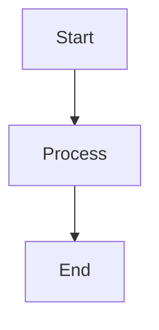

# 📝 MCP Platform Documentation Style Guide

This guide establishes consistent formatting, structure, and style standards for all documentation across the MCP Platform project.

## 🎯 Overview

All documentation should be:
- **Clear and concise** - Easy to understand for developers of all skill levels
- **Consistently formatted** - Following established patterns and conventions
- **Well-structured** - Using logical organization and hierarchy
- **Actionable** - Providing clear next steps and examples where appropriate

## 📁 File Organization

### Directory Structure

```
docs/
├── api/                    # API documentation and OpenAPI specs
├── security/              # Security-related documentation
├── integrations/          # Integration guides and examples
├── ai/                    # AI/ML specific documentation
└── DOCUMENTATION_STYLE_GUIDE.md
```

### File Naming

- Use **kebab-case** for filenames: `local-development.md`
- Use descriptive names that indicate content: `security-controls.md`
- Include step numbers for process docs: `01-setup-guide.md`
- Use consistent extensions: `.md` for Markdown files

## 🎨 Markdown Style Standards

### Headers

Use emojis in main headers to improve visual hierarchy:

```markdown
# 🚀 Service Name - Main Title
## 📋 Section Title
### Subsection Title
#### Detail Level
```

**Guidelines:**
- Use only one H1 (`#`) per document
- Include emojis for main sections (H2) when appropriate
- Keep headers descriptive and scannable
- Use sentence case, not title case

### Common Header Emojis

| Category | Emoji | Usage |
|----------|--------|--------|
| Getting Started | 🚀 | Quick start, setup guides |
| Configuration | ⚙️ | Settings, environment setup |
| API Reference | 📋 | API documentation |
| Security | 🔒 | Security guides, best practices |
| Development | 🔧 | Development tools, debugging |
| Examples | 💡 | Code examples, tutorials |
| Troubleshooting | 🔍 | Problem solving, FAQ |
| Testing | ✅ | Testing guides, validation |

### Code Blocks

Use fenced code blocks with language specification:

```markdown
```bash
# Shell commands
make local-run
```

```python
# Python code
def example_function():
    return "Hello, World!"
```

```json
{
  "example": "JSON configuration"
}
```
```

### Lists and Structure

**Unordered Lists:**
- Use `-` for primary bullet points
- Use `  -` (2 spaces) for nested items
- Keep consistent indentation

**Ordered Lists:**
1. Use numbers for sequential steps
2. Include clear action words
3. Break complex steps into sub-steps:
   - Sub-step details
   - Additional information

### Links and References

**Internal Links:**
```markdown
See [Security Controls](./security/08-security.md) for details.
```

**External Links:**
```markdown
Visit the [FastAPI Documentation](https://fastapi.tiangolo.com/) for more information.
```

**Anchor Links:**
```markdown
Jump to [Authentication](#authentication--authorization) section.
```

### Tables

Use tables for structured information:

```markdown
| Service | Port | Description |
|---------|------|-------------|
| Auth Service | 8443 | OAuth2.1 authentication |
| Context Service | 8001 | Multi-tenant context management |
| Text Summarization | 8000 | AI-powered text summarization |
```

### Code Examples

Always include:
- **Context**: What the example demonstrates
- **Prerequisites**: What's needed to run the example  
- **Expected output**: What users should see

```markdown
#### Example: Health Check

Check if the service is running:

```bash
curl http://localhost:8000/healthz
```

**Expected Response:**
```json
{
  "status": "healthy",
  "timestamp": "2024-01-15T08:00:00Z"
}
```
```

### Callouts and Admonitions

Use consistent formatting for different types of information:

```markdown
**💡 Tip:** Use this pattern for helpful suggestions.

**⚠️ Warning:** Use this for important cautions.

**🔴 Important:** Use this for critical information.

**📝 Note:** Use this for additional context.
```

## 📄 Document Templates

### Service Documentation Template

```markdown
# 🚀 Service Name

Brief description of what the service does and its role in the platform.

## 🎯 Overview

Detailed overview of the service functionality.

## 🔧 Quick Start

### Prerequisites

- Requirement 1
- Requirement 2

### Installation

```bash
make install
```

### Running the Service

```bash
make local-run
```

## 📋 API Reference

Link to generated API documentation or inline API descriptions.

## ⚙️ Configuration

| Variable | Description | Default | Required |
|----------|-------------|---------|----------|
| VAR_NAME | Description | default | Yes/No |

## 🔍 Troubleshooting

Common issues and solutions.

## 📚 Additional Resources

- [Related Documentation](./link.md)
- [External Resources](https://example.com)
```

### Process Documentation Template

```markdown
# 📋 Process Name

## 🎯 Overview

What this process accomplishes and when to use it.

## 📋 Prerequisites

- Requirement 1
- Requirement 2

## 🔧 Step-by-Step Guide

### Step 1: Action Title

Description of what to do.

```bash
command-to-run
```

**Expected Result:**
What should happen after this step.

### Step 2: Next Action

Continue with clear, actionable steps.

## ✅ Verification

How to verify the process completed successfully.

## 🔍 Troubleshooting

Common issues and their solutions.
```

## 🎨 Visual Elements

### Status Badges

Use status indicators consistently:

```markdown


```

### Diagrams

When including diagrams:
- Use Mermaid for simple flowcharts and diagrams
- Store complex diagrams as images in `docs/images/`
- Include alt text for accessibility

```markdown

```

## 📝 Writing Guidelines

### Tone and Voice

- **Clear and direct**: Avoid unnecessary jargon
- **Professional but friendly**: Helpful and approachable
- **Consistent terminology**: Use the same terms throughout documentation

### Common Terms

Use these standardized terms:

| Preferred | Avoid |
|-----------|--------|
| Service | Microservice, App |
| Endpoint | Route, URL |
| Environment variable | Env var, Config |
| Authentication | Auth (except in code) |

### Content Principles

1. **Start with the user's goal**: What are they trying to accomplish?
2. **Provide context**: Why is this important?
3. **Give clear steps**: What exactly should they do?
4. **Show expected results**: What should they see?
5. **Offer troubleshooting**: What if something goes wrong?

## 🔍 Review Checklist

Before publishing documentation:

- [ ] Headers follow emoji conventions
- [ ] Code blocks specify language
- [ ] Links work correctly
- [ ] Examples include expected output
- [ ] No typos or grammatical errors
- [ ] Consistent terminology used
- [ ] File placed in correct directory
- [ ] Table of contents updated (if applicable)

## 📚 Tools and Resources

### Markdown Linting

Use markdownlint for consistency:

```bash
# Install markdownlint-cli
npm install -g markdownlint-cli

# Lint documentation
markdownlint docs/
```

### Preview Tools

- **VS Code**: Markdown preview extension
- **GitHub**: Preview tab when editing
- **Local**: Use tools like `grip` for GitHub-flavored preview

## 🤝 Contributing

When contributing documentation:

1. Follow this style guide
2. Test all examples and links
3. Review for clarity and completeness
4. Request review from team members
5. Update any related documentation
